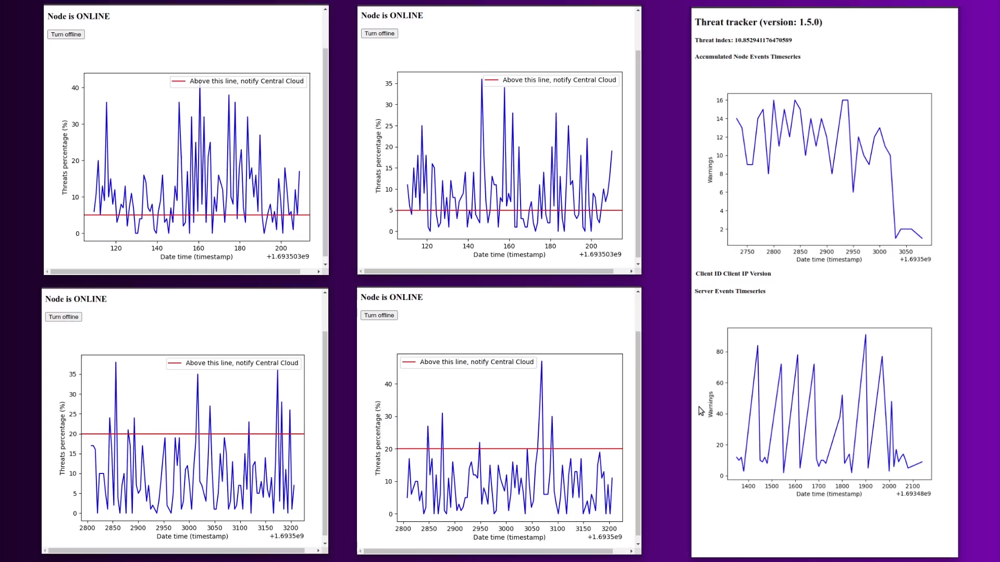
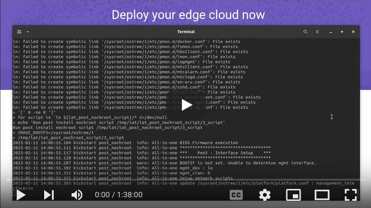
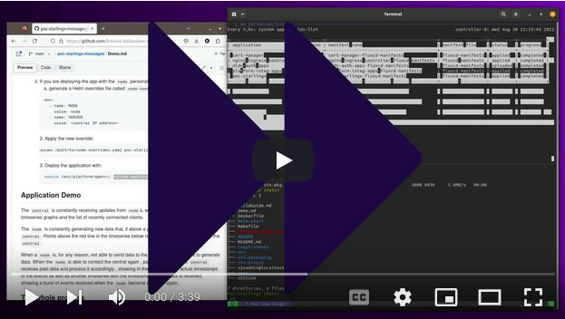

# PoC-StarlingX Packaging and Demonstration

This is an application developed as a proof of concept for the StarlingX
Platform.

The application simulates a network of antivirus scanners and threat monitoring
running independently and geographically distributed called `nodes`. When a node
detects threats above a configurable threshold in an area it reports to a
`central` instance responsible for aggregating, processing and storing data
from all the `nodes` while presenting a bird's-eye view in a simple dashboard.

The application can act either as a `node` or a `central` (which are called
"personalities") depending on the environment variables it has available.

- `Nodes` are geographically spread out doing the actual work of monitoring, for
example, local networks.
- `Central` is a deployment that receives messages from `nodes`, processing and
presenting data related to them.

We opted to deploy this poc as a StarlingX Application instead of deploying It directly through Kubernetes or with Helm Charts
because our team had two major motivations:

1. We wanted to learn more about how to build a StarlingX Application.
2. We want to make further improvements in the application to integrate
   It with StarlingX sysinv to automatize specific nodes configurations
   depending on the system states.

But we would like to make It clear that if your application does not require a
deeper integration with the StarlingX system, never needs to
change its behaviour or have changes that depend on the user only, then,
deploying the application directly into StarlingX "vanilla" Kubernetes,
with Helm Charts and even FluxCD if you'd like to enjoy the benefits of CI/CD
pipelines.

## Deploying PoC-StarlingX as a StarlingX App

1. After packaging the app, send the generated `poc-starlingx-stx-pkg.tar.gz`
file to the StarlingX active controller(s) where you want the app(s) to run. Then you
can simply run:

   ```shell
   source /etc/platform/openrc; system application-upload /path/to/poc-starlingx-stx-pkg.tar.gz
   ```

   
1. This application has two different personalities, controlled via
environment variables.
   1. If you are deploying the app with the `central` personality, simply run:

      ```shell
      source /etc/platform/openrc; system application-apply poc-starlingx
      ```

      
   2. If you are deploying the app with the `node` personality:
      1. generate a Helm overrides file called `node-overrides.yaml`:

      ```shell
      env:
        - name: MODE
          value: node
        - name: SERVER
          value: <central IP address:port>
      ```

      2. Apply the new override:

      ```shell
      source /etc/platform/openrc; system helm-override-update --values /path/to/node-overrides.yaml poc-starlingx poc-starlingx default
      ```

      3. Deploy the application with:

      ```shell
      source /etc/platform/openrc; system application-apply poc-starlingx
      ```

      

## Application Demo

[//]: # (TODO this whole text needs proofreading)

Below you are seeing a `central` running on the right side of the screen and 4
`node`s running on the left side. `Node`s 1 and 2, on the top, are running with
a threshold of 5%, which means they are more sensitive, notifying the `central`
more frequently. `Node`s 3 and 4 at the bottom are running with a threshold of
20%.

The `central` (to the right) presents the following information:

- a timeseries of the processed events (based on the timestamp when the event
was created on the `node`);
- a constantly updated list of recently connected `nodes`;
- a timeseries of received events (based on `central`'s timestamp when the event
was received).

All 4 `node`s, to the left, are constantly generating new data. This random data
is generated using a long tail distribution and, if above a configured threshold
for the `node`, the data is sent to the `central`. Points above the red line in
the timeseries represent the data from each node that is sent to the `central`.



When a `node` is, for any reason, not able to send data to the `central`, it
continues to generate and accumulate data.

> _NOTE_: This offline status can be simulated with the click of a button in
this demonstration.


Notice how the number of reported events has gone down from around 12 to 2 and
the aggregated Threat Index went from around 11 to 8 during the time that
`node`s 1 and 2 were offline.

When the `node`s are able to reach the `central` again, accumulated data
is then sent to the `central`.


The `central` takes its time processing the recent burst of data and:

- updates its first graph to reflect the new data received by the `node`s;
- shows a spike of events received on the second graph.

## The whole process

Installing StarlingX (automated script):

[](https://www.youtube.com/watch?v=6z7EV17Emcw)

Deploying and demonstration:

[](https://youtu.be/IvBomQANXlo)
